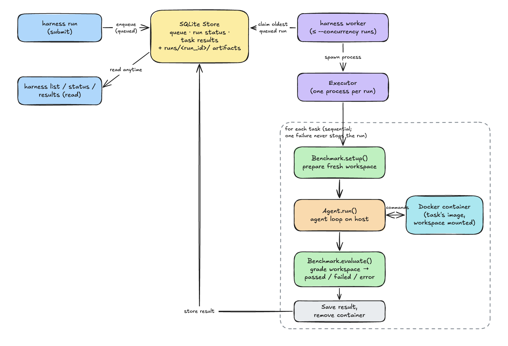

# Agentic Harness: Guide

Run **any agent** against **any benchmark** from one CLI. You submit runs to a queue, background workers execute them, and every task runs in its own Docker container. Results are stored in SQLite and reported as accuracy.

## Setup

**Prerequisites:** Python 3.11+, [uv](https://docs.astral.sh/uv/), Docker (running), and an LLM API key.

```bash
make init                     # fetch the mini-swe-agent submodule
make install                  # install the harness + mini-swe-agent into .venv
source .venv/bin/activate     # or prefix commands with `uv run`

mini-extra config setup       # set mini-swe-agent's model + API key (once)

make test                     # run the test suite (Docker required)
```

Use a model ID without a date suffix (e.g. `anthropic/claude-sonnet-5-5`), and a workspace-scoped API key for Anthropic.

To check your setup for free (no LLM), run the scripted test agent:

```bash
harness run --agent tests/fixtures/agents/scripted --benchmark bash-operations --task_ids bash-001 --wait
```

## Usage

```bash
# Submit runs to the queue (each returns immediately with a run ID)
harness run --agent agents/mini-swe-agent --benchmark bash-operations
harness run --agent agents/mini-swe-agent --benchmark python-tasks --task_ids py-001,py-002

# Start a worker in another terminal; it executes up to N runs at once (default N=2)
harness worker --concurrency N

# Monitor and get results
harness list                                      # active runs (--all for history)
harness status  --run_id <run_id>                 # one run's progress, task by task
harness results --run_id <run_id>                 # JSON (default)
harness results --run_id <run_id> --format table  # or: summary

# Skip the queue and run in the foreground
harness run --agent agents/mini-swe-agent --benchmark python-bugfix --wait
```

**Notes:**
- **Benchmarks:** `bash-operations`, `python-tasks` and `python-bugfix`. You can also pass a path to a benchmark folder.
- **Run options:**
  - `--task_ids` runs a subset (all tasks if omitted);
  - `--task-timeout` sets the seconds allowed per task (default 900).
- **Queued runs wait for a worker.** An idle worker simply waits for new runs.
- **Stopping a worker:** Ctrl-C stops it taking new runs and lets running ones finish. A second Ctrl-C aborts them.
- **Task outcomes:**
  - `passed` / `failed`: the grader's verdict on the agent's work;
  - `error`: the harness couldn't judge it (setup, Docker or grader broke).

  Results report accuracy both with and without errors.
- **Debugging:** each task's files (workspace, prompt, agent log, trajectory) are in `runs/<run_id>/tasks/<task_id>/`.

## System design

https://excalidraw.com/#json=viCiVs2PH5W9r6eAYLN9g,EjqeCVnYPO75cDAM4Ztuwg



**Flow:**
1. **Submit.** `harness run` validates the agent, benchmark and task IDs, stores the run as **queued** in SQLite, and returns.
2. **Schedule.** `harness worker` claims the oldest queued run (each run is claimed by exactly one worker) and starts an executor process for it. At most `--concurrency` runs execute at once.
3. **Execute.** The executor runs the tasks one by one. For each task:
   1. **Setup:** the benchmark prepares a fresh workspace.
   2. **Agent:** the agent solves the task inside a Docker container built from the task's image, with the workspace mounted.
   3. **Grade:** the benchmark grades the workspace.
   4. **Save:** the result is stored and the container removed. One task's failure never stops the run.
4. **Report.** `list`, `status` and `results` read from SQLite at any time; `results` aggregates accuracy.

**Components** (`src/agentic_harness/`). The core never names a specific benchmark or agent; they plug in through these interfaces:

| Component | Role |
|---|---|
| **Benchmark** (`benchmarks/`) | Lists tasks, sets up a workspace, grades it. Driven by each benchmark's `harness.yaml`. |
| **Agent** (`agents/`) | Solves a task inside the sandbox. Adapters: mini-swe-agent, and a scripted test agent. |
| **Sandbox** (`sandbox.py`) | One Docker container per task, with the workspace mounted; always cleaned up |
| **Store** (`store.py`) | SQLite: the queue, run status, task results. Plus per-task artifact folders. |
| **Worker / Executor** | The worker pulls runs from the queue; the executor runs one run's tasks |

**Key design decisions:**
- **SQLite is both the queue and the results database.** There's no extra service to run. A multi-machine setup would swap in Postgres.
- **Each run executes in its own process,** so one run crashing can't affect others. The concurrency limit counts runs.
- **The agent loop runs on the host; its commands run in the task's container.** API keys stay out of containers, and minimal images work.
- **Benchmark setup and grading run on the host,** against the shared workspace.

## Adding a benchmark

Create `benchmarks/<name>/` with your dataset, a setup script, a grading script, and a `harness.yaml` describing how to call them. The harness needs no code changes. For example:

```yaml
name: my-benchmark
dataset: dataset.json                                        # JSON list of tasks
fields: {id: id, prompt: prompt, docker_image: image}        # which dataset fields hold these
setup:    ["{python}", "setup.py", "{task_id}", "{workspace}"]
evaluate: ["{python}", "grade.py", "{task_id}", "{workspace}"]
pass_from: json.passed          # grader prints JSON with "passed" (and optional "score"); or: exit_code
prompt_template: "{prompt}"     # optional; can use any dataset field, e.g. "{prompt}\n\nWrite it in {solution_file}"
timeout: 120                    # seconds per setup/grade call
```

- **Each task names its own Docker image** in the dataset; that's the environment the agent works in.
- **Placeholders:** `{python}`, `{workspace}`, `{task_id}`, `{benchmark_dir}`.
- **Outcomes:** a grader that crashes or prints no verdict gives `error`, not `failed`.
- **Try it:** `harness run --agent tests/fixtures/agents/scripted --benchmark my-benchmark --wait`.
- **Example:** `benchmarks/python-bugfix/` is a complete one, with partial-credit scoring.
- **Other kinds of benchmark:** for one that isn't "dataset + scripts", set `class: "pkg.module:MyBenchmark"` in `harness.yaml` and subclass `agentic_harness.benchmarks.Benchmark` in Python.

## Adding an agent

1. **Write an adapter.** Subclass `agentic_harness.agents.Agent` and implement:
   ```python
   run(prompt, task, sandbox, artifacts_dir, timeout) -> AgentOutput
   ```
   - Run the agent's commands in the task's container, using `sandbox.image` and `sandbox.run_args()` (they mount the workspace).
   - Write logs to `artifacts_dir`.
   - Set `error` only if the agent couldn't run at all.
2. **Register it** in `ADAPTERS` in `src/agentic_harness/agents/__init__.py`.
3. **Add a config:** give the agent's folder a `harness-agent.yaml`:
   ```yaml
   adapter: my-agent
   # ...any settings your adapter reads
   ```
4. **Run it:** `harness run --agent agents/my-agent --benchmark bash-operations`.

`src/agentic_harness/agents/mini_swe.py` is a complete example.
